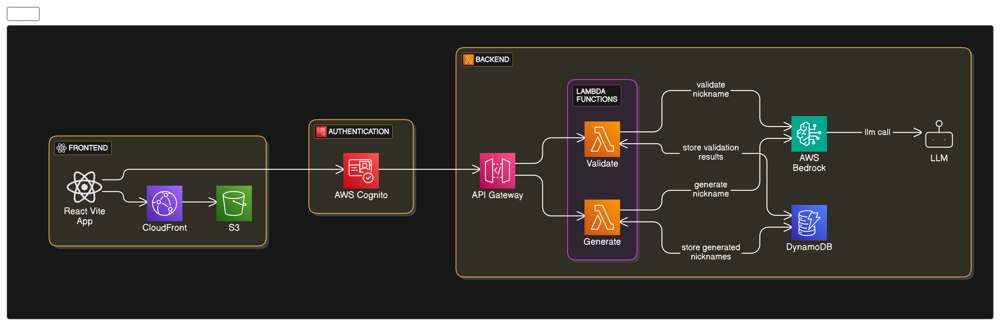
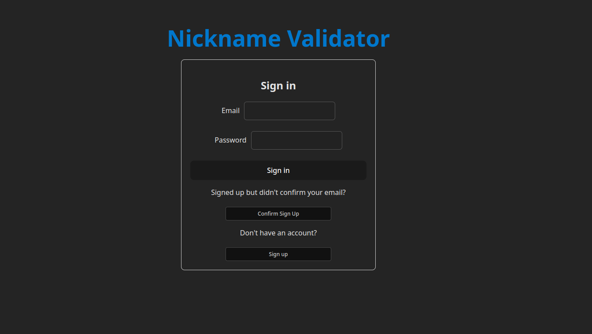
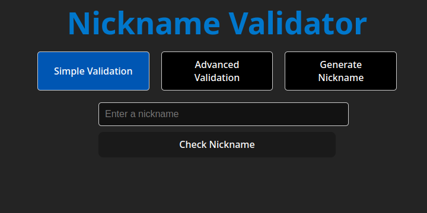
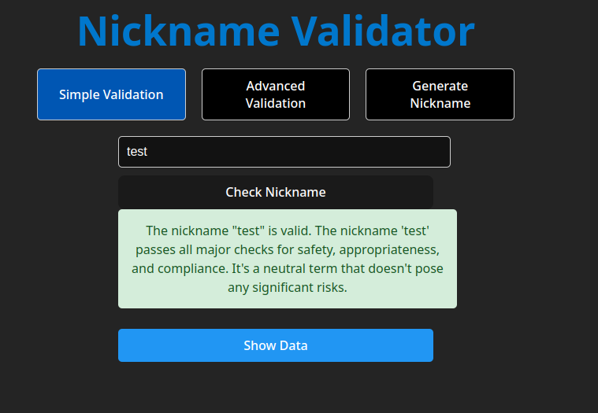
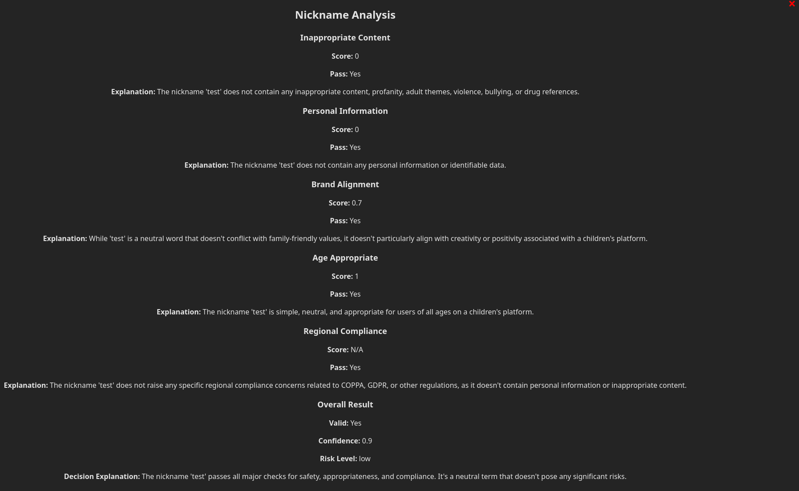
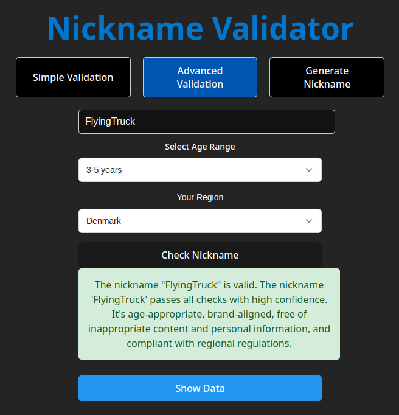
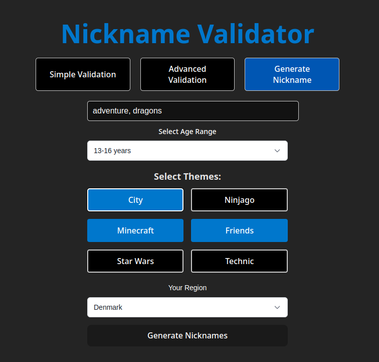
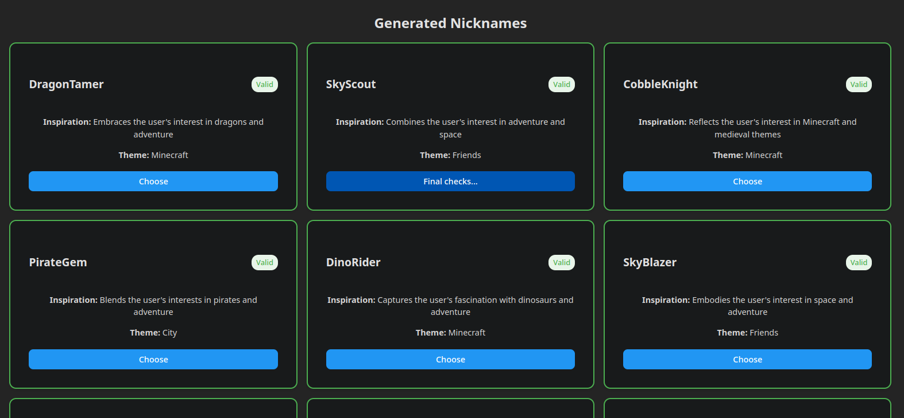
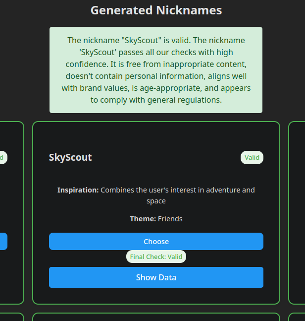
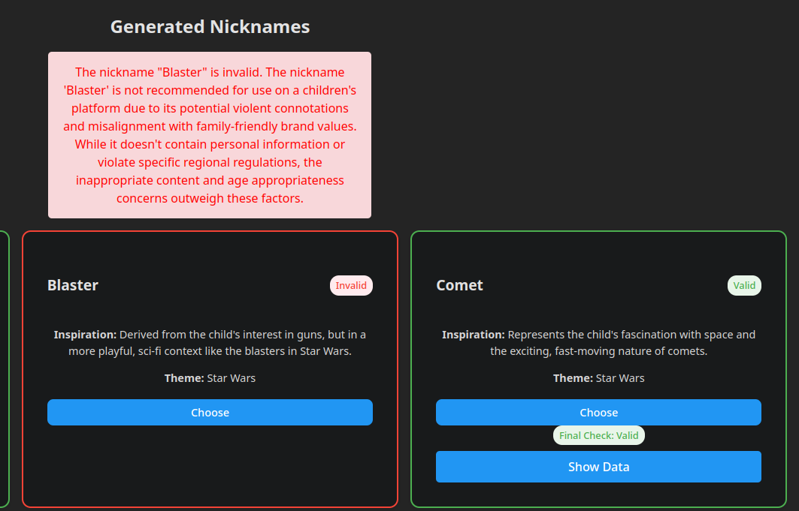

# Aws Nickname Validation POC

## Table of Contents

1. [Overview](#overview)
2. [Key Features](#key-features)
3. [Purpose](#purpose)
4. [Technology Stack](#technology-stack)
5. [Application Flow](#application-flow)
6. [Prerequisites](#prerequisites)
7. [Deploying the Application](#deploying-the-application)
8. [Future refinements](#future-refinements)

## Overview
This application is designed to **generate** and **validate** nicknames for a **child-based platform**, ensuring they are creative, appropriate, and compliant with global regulations. The system leverages **Large Language Models (LLMs)** to both create and evaluate nicknames while strictly adhering to **COPPA**, **GDPR**, and other relevant data privacy and child protection laws.



## Key Features
- **Nickname Generation**  
  Uses LLMs to create fun, safe, and engaging nicknames suitable for users of all ages, particularly children.

- **Validation Engine**  
  - Validates **user-submitted nicknames**.  
  - Validates **LLM-generated nicknames**.  
  - Ensures compliance with a child platform guidelines, including restrictions on language, personal information, and appropriateness.

- **Regulatory Compliance**  
  - Adheres to **COPPA** (Children's Online Privacy Protection Act) regulations to protect children’s privacy.  
  - Complies with **GDPR** (General Data Protection Regulation) standards for data privacy and security.  
  - Filters out any personally identifiable information (PII), offensive language, or inappropriate content.

- **Customizable Ruleset**  
  Validation logic can be adjusted to fit additional platform guidelines or regional compliance requirements.

## Purpose
The goal of this application is to provide a **safe and fun user experience** by ensuring that all nicknames are appropriate for a **child-friendly online environment**. By integrating AI-powered generation with robust validation, the system guarantees both creativity and safety.

## Technology Stack

- **Frontend**:  
  - React + Vite  
  - Deployed via **AWS S3** + **CloudFront** for scalable and secure web delivery  
  - User authentication powered by **AWS Cognito**

- **Backend**:  
  - Python (AWS Lambda functions)  
  - Exposed through **AWS API Gateway**  
  - Serverless architecture for efficient and scalable backend processing

- **AI/ML**:  
  - **AWS Bedrock** for scalable LLM-powered nickname generation and validation  
  - Calls to Large Language Models (LLMs) for generating creative, compliant nicknames and performing advanced validation

- **Compliance Framework**:  
  - Custom validation logic enforcing **COPPA**, **GDPR**, and other child specific rules  
  - Filters to ensure no PII, inappropriate language, or rule violations are present in nicknames

- **Infrastructure & Deployment**:  
  - Infrastructure-as-Code (IaC) with AWS CDK 

## Application flow

The following section describes the flow of application



### Security 

The website first redirects you to the login page


To access the main content of the website, you need to do the following:

1. Sign up
2. Confirm your email by copying the code and using the confirm email page on the website
3. Login

After you login you will be able to access all the features that the website provides

### Simple validation

Simple validation is the most basic feature.




You can choose a nickname to validate with an LLM call. Behind the scenes the api call of `validate-nickname` is called, which is called in various places of the application.

When you check nickname, the api either outputs a cached nickname from dynamoDB or it will make the a call to AWS Bedrock to generate the nickname validation:




Or you can view all the data the model has generated, which shows which areas he considered:



### Advanced validation

This is very similar as the [Simple validation](#simple-validation) but you are required to also give 2 extra arguments:

1. **age range**: the model would consider how good the name is for the specific age range
2. **region**: the model uses this to consider specifical country regional regulations based on its knowledge base



### Generate nickname

The generate nickname page let's you generate nicknames based on the following:

1. Generations preferences:
    1. **interests**
    2. **age range**
    3. **themes**

2. **region**: When generating names considers the regional regulations



Here a different api is called to call an LLM to generate the nicknames and also do a small validation on them to make sure they are following the regulations.



Each of the generated nickname can be chosen to be checked by the main validation pipeline.



We let our generation model to output names that it considers invalid so they can be check with our main validation pipeline:



This concludes the features that the web application has.

## Prerequisites

### AWS CLI and CDK

First, install both the AWS CLI and AWS CDK:

#### Installing AWS CLI

You can install AWS CLI manually by downloading and unzipping the installation file:

```bash
curl "https://awscli.amazonaws.com/awscli-exe-linux-x86_64.zip" -o "awscliv2.zip"
unzip awscliv2.zip
sudo ./aws/install
```

#### Installing AWS CDK

AWS CDK is installed using npm as a global package:

Make sure you have npm installed: [Installing nodejs](#installing-nodejs-and-packages)

```bash
npm install -g aws-cdk
```

#### Configuring AWS CLI

Once the AWS CLI is installed, configure the security credentials. The AWS CDK will inherit these credentials from the AWS CLI.

For instructions on setting up the AWS CLI, refer to the [AWS CLI User Guide](https://docs.aws.amazon.com/cli/latest/userguide/cli-configure-files.html).

To configure the AWS CLI, run:

```bash
aws configure
```

Then, provide your credentials. It is recommended to use short-term credentials with IAM Identity Center for enhanced security.

#### My Setup

For reference, my setup includes the following versions:

- `cdk --version` output: `cdk==2.1003.0 (build b242c23)`
- `aws --version` output: `aws-cli/2.24.19 Python/3.12.9 Linux/6.8.0-52-generic exe/x86_64.ubuntu.22`

### Frontend: React + Vite

For the frontend, you will need **React** and **Vite**.

#### Installing Node.js and Packages

To set up the frontend, follow these steps:

1. **Install Node.js**:  
   You need Node.js to run React and Vite. You can install the latest version of Node.js from [the official Node.js website](https://nodejs.org/), or use a package manager like `nvm` (Node Version Manager) to manage versions.

   - To install `nvm` (optional, but recommended), run the following command in your terminal:  
     `curl -o- https://raw.githubusercontent.com/nvm-sh/nvm/v0.39.3/install.sh | bash`  
     After installation, restart your terminal and then install the latest version of Node.js by running:  
     `nvm install node`

   - Alternatively, you can install Node.js directly from the official website.

2. **Navigate to the Frontend Folder**:  
   Change your directory to the `nickname-app` folder inside the `web` directory:  
   `cd web/nickname-app`

3. **Install Dependencies**:  
   Install the necessary packages, including React and Vite, by running:  
   `npm install`

   This command will install the dependencies listed in the `package.json` file.

4. **Check that everything is set up properly**:  
   After the installation is complete, check the project is bulding:  
   `npm run build`

#### Additional Notes

- Make sure you have the required versions of Node.js and npm for compatibility with React and Vite.
- If you encounter any issues with dependencies or installation, try deleting the `node_modules` folder and the `package-lock.json` file, and then run `npm install` again.

## Deploying the Application

This section outlines the steps required to deploy both the **backend** and **frontend** components of the application.

---

### Overview of Deployment Steps

1. **Set up the Python environment** for the backend.
2. **Deploy the Backend** using AWS CDK.
3. **Configure Environment Variables** using the output from the backend deployment.
4. **Deploy the Frontend** to AWS S3 + CloudFront.

---

## 1. Set up the Python Environment

Before deploying the backend, you need to set up a Python environment using Conda. Follow these steps:

### Installing Conda

If you don't have Conda installed, you can follow these steps to install it:

1. **Download and install Miniconda** (a minimal Conda installer):
   - Go to the [Miniconda download page](https://docs.conda.io/en/latest/miniconda.html).
   - Download the appropriate version for your system (e.g., Miniconda3 for Linux, macOS, or Windows).
   - Follow the instructions on the page to install Miniconda.

2. **Verify Conda installation**:  
   After installation, open your terminal and verify that Conda is installed by running:  
   `conda --version`

   This should return the version of Conda you have installed.

### Setting up the Python environment

Once Conda is installed, follow these steps to set up the Python environment:

```bash
conda create -n infrastructure python=3.12
conda activate infrastructure
cd ./infrastructure
pip install -r requirements.txt
```

## 2. Deploying the Backend

Run the following commands to deploy the backend infrastructure:

```bash
cd infrastructure
cdk deploy ArniaNicknameModerationBackendStack
```

**Important**:
Once the deployment is complete, save the output values, as they will be needed in the next step to configure the frontend.

Example CDK Output:

```
Outputs:
ArniaNicknameModerationBackendStack.BedrockApi = https://m8aenb09e8.execute-api.eu-west-1.amazonaws.com/prod/
ArniaNicknameModerationBackendStack.arnianicknamemoderationbedrockapiEndpoint17D97578 = https://m8aenb09e8.execute-api.eu-west-1.amazonaws.com/prod/
ArniaNicknameModerationBackendStack.userPoolClientId = dnboeaj82649jo3hs028grjl4
ArniaNicknameModerationBackendStack.userPoolId = eu-west-1_Pgq8zS6v3
```

## 3. Configuring Environment Variables for the Web App

After deploying the backend, you need to configure the frontend environment variables using the outputs from the previous step.

Edit the .env file located at:

```bash
web_app/nickname_app/.env
```

Example .env file:

```dotenv
VITE_BEDROCK_API_URL=https://m8aenb09e8.execute-api.eu-west-1.amazonaws.com/prod/
VITE_USER_POOL_ID=eu-west-1_Pgq8zS6v3
VITE_USER_POOL_CLIENT_ID=dnboeaj82649jo3hs028grjl4
VITE_AWS_REGION=eu-west-1
```

Make sure to replace the values with your actual outputs from [Step 2](#2-deploying-the-backend).

## 4. Deploying the Frontend

**Note**:
Ensure you have React and Vite installed in your local environment before proceeding with the build and deployment.

Run the following command to deploy the frontend stack:

```bash
cd infrastructure
cdk deploy ArniaNicknameModerationFrontendStack
```

After deployment, your website will be hosted on AWS S3 and served through CloudFront. The CloudFront URL will be provided as part of the CDK output.

## Deployment Complete

Your application is now fully deployed and ready to use!

If you encounter any issues:

- Verify the `.env` variables are correctly set in the frontend.
- Check the AWS CloudFormation console for the status of your stacks.
- Review the CDK deployment logs for any errors.

## Future Refinements

While the current system is functional, there are several areas where improvements could be made to enhance both the robustness and flexibility of the nickname generation and validation process. Below are some potential refinements to consider:

### 1. **Improving Validation with Embeddings Distance**

To improve the accuracy and safety of nickname validation, adding an **embeddings distance** verification step could be beneficial. By storing a list of previously flagged or bad names in **DynamoDB**, we can compare new nicknames to these stored entries using embeddings distance. This would allow the system to detect nicknames that are semantically similar to inappropriate names, even if they are not exact matches.

### 2. **Specialized Prompts for High-Risk Nicknames**

For certain edge cases, especially when the nickname is deemed "high-risk" but still technically valid, specialized prompts can be used to evaluate the content more rigorously. This could involve tweaking the LLM's generation prompts to focus on specific concerns, such as:
- **Potentially offensive content**: If the nickname includes certain sensitive keywords or patterns, the model can be prompted to assess if the nickname might be interpreted negatively in specific cultures or languages.
- **Compliance checks**: If a nickname might violate certain child protection laws or privacy regulations (like GDPR or COPPA), specialized prompts can trigger additional checks or automatic rejections.

### 3. **Enhanced Customizable Validation Rules**

To provide more flexibility for different platforms or regional regulations, further refinement of the validation engine can allow for **customizable validation rules** based on:
- **Regional regulations**: Customize validation rules to align with local legal requirements for children’s online privacy and safety (e.g., stricter filters in certain regions).
- **Platform-specific guidelines**: Enable configuration options for the platform owner to adjust nickname guidelines based on internal policies, such as avoiding specific themes or keywords.

### 4. **User Feedback and Iterative Improvement**

Incorporating user feedback for problematic or false-positive cases would allow continuous improvement of the system. By collecting feedback from users and administrators on the accuracy of the nickname validation process, the system can evolve to better understand context and improve decision-making.

### 5. **Overall performance and cost optimizations**

- **Bedrock Token Usage**: The prompts could be optimized to use fewer tokens while maintaining accuracy. The current prompts include verbose instructions that contribute to token costs.

- **Restrict Bedrock Models**: Restrict the access to only specific bedrock models and optimize model choice based on request and usage.

- **Resource Sizing**: Lambda function memory optimization. Right-sizing Lambda functions and reducing timeout could reduce costs while maintaining performance.

- **Cold Starts**: Implement provisioned concurrency for critical functions

- **SSM parameters**: Use SSM to pass information between stacks. Overall security for any secret parameters needed.

### 6. **Maintainability**

- **Testing**: No automated tests for the Lambda functions or frontend components.

- **CI/CD Pipeline**: No CI/CD pipeline is implemented for automated deployment and testing.

- **CloudWatch**: More logging and dashboards can be added for better monitoring. Also cost monitoring, budgets and analysis.
